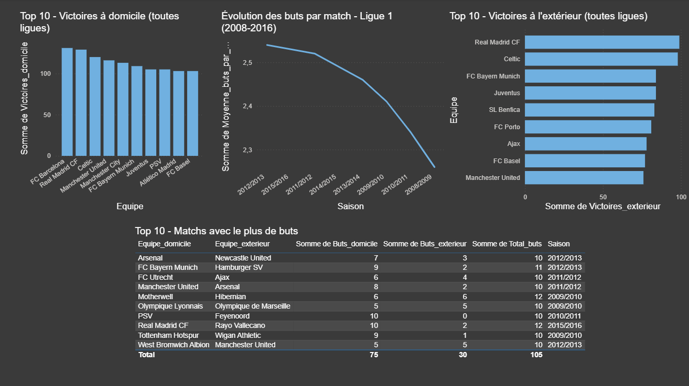

# ⚽ Analyse SQL & Power BI — Statistiques Football Européen

## 📌 Contexte
Ce projet fait partie de mon portfolio Data Analyst. L'objectif est d'extraire des insights à partir de données réelles de football européen via SQL, puis de les visualiser dans Power BI.

**Dataset :** European Soccer Database (Kaggle) — +25 000 matchs, 11 ligues, 8 saisons (2008-2016)

---

## 🛠️ Outils utilisés
- **DB Browser for SQLite** — Requêtes SQL
- **Microsoft Excel** — Export et stockage des résultats
- **Power BI Desktop** — Dashboard et visualisation

---

## 📁 Fichiers du projet
| Fichier | Description |
|---|---|
| `requetes.sql` | Les 4 requêtes SQL commentées |
| `Book 1.xlsx` | Données exportées (4 onglets) |
| `Dashboard.png` | Screenshot du dashboard Power BI final |

---

## 📊 Analyses réalisées
1. **Top 10 victoires à domicile** — FC Barcelone domine avec 131 victoires
2. **Matchs avec le plus de buts** — Real Madrid 10-2 Rayo Vallecano, Motherwell 6-6 Hibernian
3. **Évolution buts/match en Ligue 1** — Progression de +0.27 but/match sur 8 saisons
4. **Top 10 victoires à l'extérieur** — FC Barcelone encore leader avec 103 victoires

---

## 📈 Dashboard final

---

## 👤 Auteur
**Jack Kadjo Touré** — Étudiant en Marketing Digital & Data Analysis (ISTEC Paris)  
[LinkedIn](https://www.linkedin.com/in/jacktoure) | [Portfolio](https://ton-portfolio.netlify.app)
